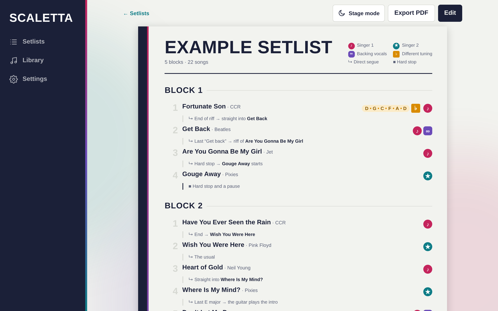
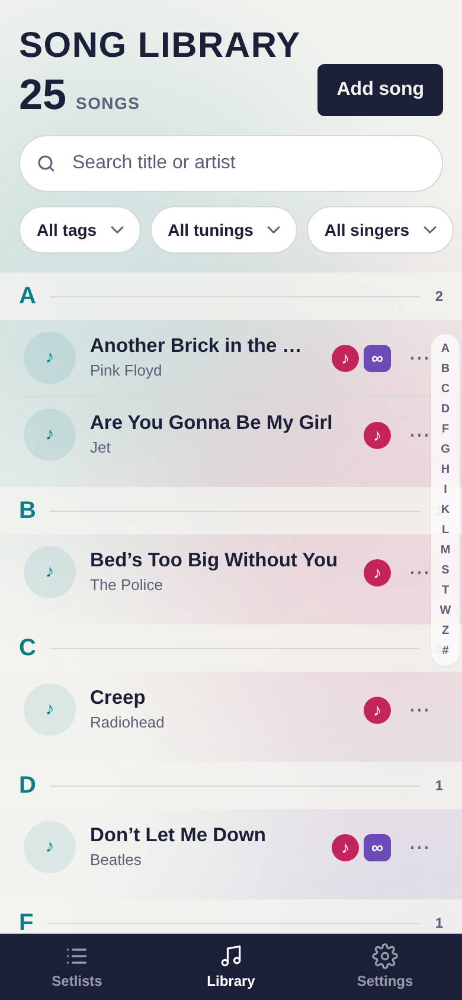
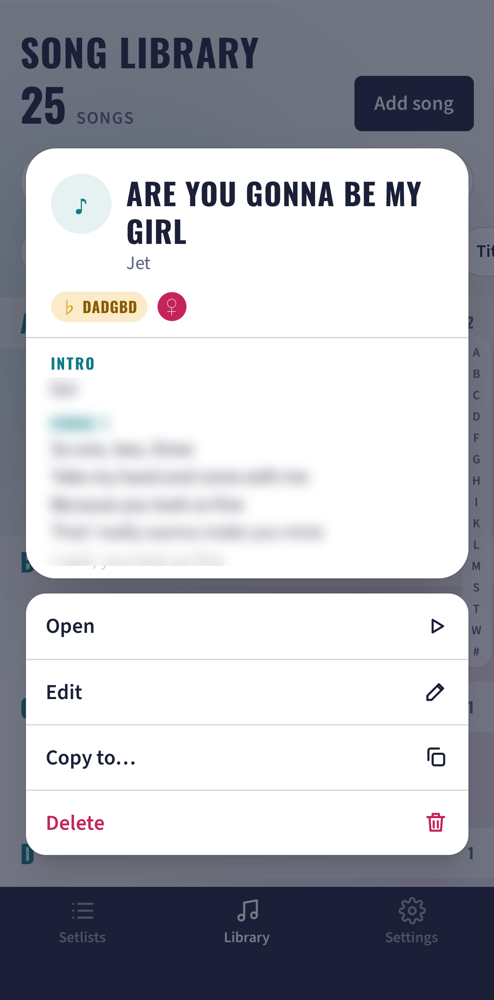
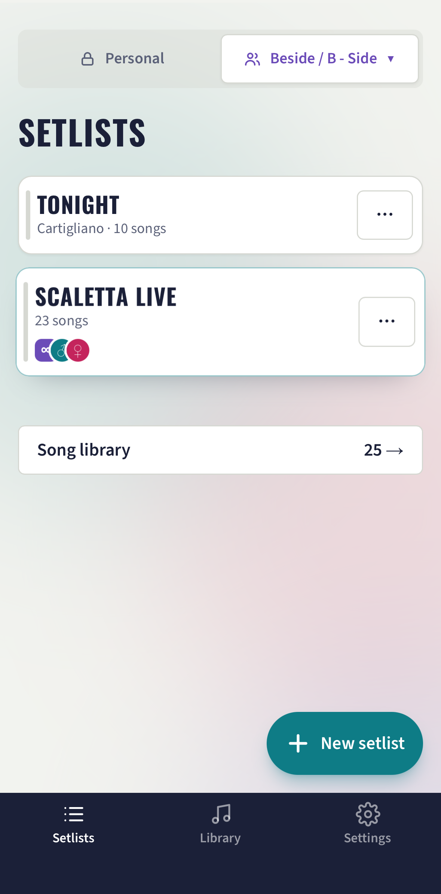
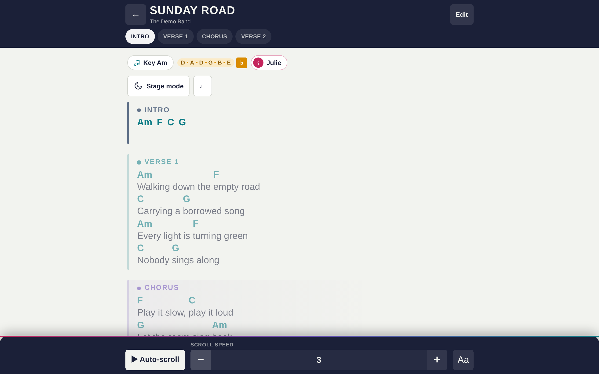
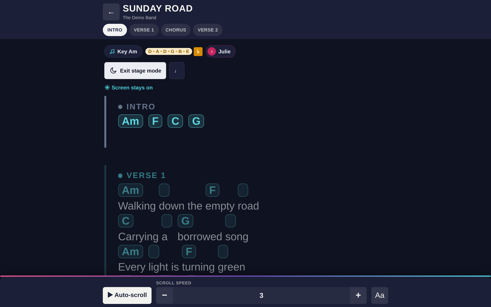

# Scaletta

[](https://github.com/KaweAW/setlistmaster/actions/workflows/ci.yml)

**Live demo: [test-setlistmaster.netlify.app](https://test-setlistmaster.netlify.app/)** (it opens with an example setlist; nothing leaves your device unless you turn on sharing).
The interface is in English by default and can be switched to Italian in Settings. The example setlist is the band's real one, so its song notes are in Italian.

Scaletta is a setlist app I built for my own cover band. Paper setlists and shared chat threads fall apart on stage:
who sings what, which guitar is in drop D, what comes next without a pause. Here the setlist, the chord charts and the
stage view live in one installable app that keeps working with no signal at all, and the band can optionally share
everything live.

<p align="center">
  
</p>

<table>
  <tr>
    <td width="33%"></td>
    <td width="33%"></td>
    <td width="33%"></td>
  </tr>
  <tr>
    <td align="center">Library</td>
    <td align="center">Long-press preview</td>
    <td align="center">Personal and shared bands</td>
  </tr>
</table>

<table>
  <tr>
    <td width="50%"></td>
    <td width="50%"></td>
  </tr>
  <tr>
    <td align="center">Chord chart with sections</td>
    <td align="center">Stage mode</td>
  </tr>
</table>

Song lines in the pictures are invented or blurred; Scaletta never ships lyrics or chords.

## Engineering notes

- **Local-first, optional cloud.** Every edit is written to IndexedDB first (repository abstraction over Dexie) and queued in an outbox; a small sync engine pushes it to Supabase and pulls what is new (cursor-based, idempotent, last write wins per record). Without a cloud project the app is fully functional.
- **Permissions in the database.** Bands, members and roles (creator, editor, viewer) are enforced with Postgres row-level security, and the policies are tested against a real Postgres (PGlite), including the "a stranger cannot read or write anything" cases.
- **Pure domain core.** `src/core/` has no React and no browser APIs (ChordPro and chords-over-words parsing, section detection, transposition, tunings, setlist operations as pure `tree -> tree` functions, so undo/redo is just snapshots). ESLint enforces the boundaries between `core/`, `data/` and the UI.
- **Quality gates.** TypeScript strict, ESLint, more than 350 unit, UI and database tests, and a CI workflow that runs typecheck, lint, tests and build on every pull request.
- **Real PWA.** Installable, cached in full after the first visit, with updates that wait for a tap so a gig is never interrupted.
- [`docs/decisions.md`](docs/decisions.md) records the reasoning behind each phase.

## Features

- **Setlists** in blocks, with drag and drop, transitions ("direct segue", "hard stop"), who sings each song, and alternate tunings.
- **Song library** with search and filters, chord charts in ChordPro or chords-over-words, transposition and capo.
- **Instrument parts**: every song has its plain text, and each instrument (lead, rhythm, bass, piano… you edit the list) can have its own chart, opening on the instrument you play.
- **PDF charts** attached to songs (several per part, picked from a list), viewed offline.
- **Stage mode**: dark screen, large text, screen kept awake, auto-scroll, no editing buttons.
- **PDF export** of the setlist, laid out for A4.
- **Works offline**: the whole app is cached after the first visit; data lives on the device (IndexedDB).
- **Backup and restore** as a single JSON file.
- **Italian and English** interface (English is the default; switch in Settings, the choice is remembered), light and dark theme.
- **Optional sharing**: invite bandmates by link or email, with roles, and sync live between devices (needs a free Supabase project).

Not included: lyrics or chords are never preloaded and nothing is scraped from the web. You add your own.

## Tech

React 18, TypeScript (strict), Vite, Tailwind CSS, Zustand, Dexie (IndexedDB), Zod, dnd-kit, ChordSheetJS,
react-pdf, vite-plugin-pwa (Workbox), Supabase (optional), Vitest + PGlite for tests.

## Getting started

Requires Node.js 20 or newer and [pnpm](https://pnpm.io).

```bash
pnpm install
pnpm dev          # http://localhost:5173
pnpm test         # unit, UI and database-rule tests
pnpm test:e2e      # end-to-end tests in a real browser (needs `pnpm build` first; `pnpm exec playwright install chromium` once)
pnpm typecheck    # tsc --noEmit
pnpm lint         # ESLint (also enforces the core/ and data/ boundaries)
pnpm build        # production build in dist/
```

On first run the app creates a local band and an example setlist (song titles and artists only, no lyrics or chords).
Data lives in IndexedDB (`scaletta` database). To start over: browser devtools > Application > IndexedDB > delete `scaletta`.

## Project layout

- `src/core/` – pure domain logic (types, Zod schemas, chords, ordering). No React, no browser APIs.
- `src/data/` – `repository.ts` (abstract interfaces) and `dexie/` (the only code that touches Dexie).
- `src/sync/` – the sync engine (outbox, cursor, last write wins per record).
- `src/cloud/` – Supabase client, sign-in and band sharing.
- `src/pages/`, `src/components/`, `src/i18n/`, `src/state/`, `src/hooks/` – UI.
- `supabase/` – database schema with row-level security, and its tests.
- [`docs/decisions.md`](docs/decisions.md) – why things are the way they are.

## Install and offline use

- After the first visit online the app is cached in full and works in airplane mode.
  Settings > "Data and offline" shows whether that has happened. New versions wait for a tap on "Reload"; they never
  replace the app on their own.
- iPhone/iPad: open the site in Safari > Share > Add to Home Screen. Mac: Safari > File > Add to Dock (or Chrome's install button).
- Settings > Backup saves one JSON file with everything (songs, setlists, PDFs) and restores it. Keep a copy outside the device.

## Deploying

Any static host with HTTPS works (Netlify and Cloudflare Pages are set up out of the box): build command `pnpm build`, output directory `dist`.
HTTPS is required for the PWA features, and every unknown path must return `index.html` (single-page app):
`public/_redirects` does it on Netlify and Cloudflare Pages; on another host add the equivalent rewrite rule.

## Sharing and sync (optional)

Without a cloud project everything works on one device, and the sharing section simply says it is not set up.
To enable it you need a free [Supabase](https://supabase.com) project:

1. In the Supabase **SQL editor**, run the files in `supabase/migrations/` once each, in order: `0001_cloud.sql`, `0002_instruments.sql`, `0003_pdf_storage.sql`, `0004_band_management.sql` (if you already ran some, run only the ones after the last you ran). The third creates the private `pdfs` storage bucket and its access rules; nothing to set up by hand in Storage.
2. **Authentication > Providers**: keep Email on (optionally turn off "Confirm email").
   **Authentication > URL configuration**: set Site URL to the address of the published app.
3. Copy the project URL and the public key (Project settings > API) into `VITE_SUPABASE_URL` and
   `VITE_SUPABASE_ANON_KEY`. Locally, copy `.env.example` to `.env.local` and restart `pnpm dev`;
   on the host, set them as environment variables and redeploy. Never use the `service_role` key.
4. In the app: Settings > Sharing and sync > create an account > "Share this band" > "Invite".
   A link works for anyone once, for 7 days; an invitation for an email address can only be accepted by that address.

Roles: **creator** (the only one who invites, changes roles, removes members and revokes invitations),
**editor** (changes songs and setlists), **viewer** (reads and plays; editing buttons are hidden).

What syncs: songs (with chords and notes), instruments and parts, setlists, blocks, entries, singers, tunings and **PDFs**
(each PDF is stored privately in Supabase Storage, up to 25 MB per file; every device downloads the ones it is missing,
so charts still open offline on stage, and the song page has a "Download now" button for one that has not arrived).
Edits are saved locally first and sent when there is a connection;
if two people edit the same record, the later edit wins. The access rules live in the database (row-level security)
and are tested on a real Postgres (PGlite), including that a viewer or a stranger cannot read or write anything.

## License

[MIT](LICENSE) © 2026 Kawe Longon
